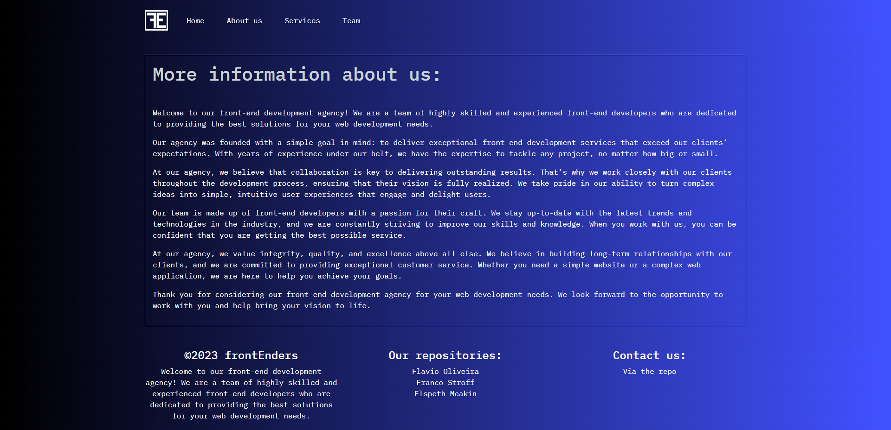

# frontEnders
<div align="center">

[](https://github.com/fl4viooliveira/react-portfolio/graphs/contributors)
[](https://github.com/fl4viooliveira/react-portfolio/forks)
[](https://github.com/fl4viooliveira/FrontEnders/stargazers)
[](https://github.com/fl4viooliveira/FrontEnders/issues)

</br>

[](https://skillicons.dev)
</div>
</br>

## Description
A React application which uses WordPress as a storage system for information which can be called using an API to render a webpage. We have used this to generate an agency website which will show information about the company, what services it can provide, and information about the individual team members.

The website will contain 4 pages: 
<ol>
<li>The homepage:</li>
<ul>
<li>Short subtitle about the company.</li>
<li>An image with a css animation.</li>
</ul>
<li>The 'About us' page:</li>
<ul>
<li>More information about the company rendered using the WordPress API.</li>
</ul>
<li>The 'Services' page</li>
<ul>
<li>Contains cards showing services provided rendered using the WordPress API.</li>
<li>Each card opens up into a new page also rendered using the WordPress API.</li>
</ul>
<li>The 'Team' page</li>
<ul>
<li>Contains cards showing the team members rendered using WordPress API.</li>
<li>These cards are animated using the npm package 'react-parallax-tilt'.</li>
<li>Each card opens to a different page for each team member with more information, also rendered using WordPress API.</li>
</ul>
</ol>

Each page will have the navigation bar and footer.

## Table of contents
- [Usage](#usage)
- [Installation](#installation)
- [Contributing](#contributing)
- [License](#license)
- [Tests](#tests)
- [Questions](#questions)
- [Acknowledgments](#acknowledgments)

## Usage
The website will open into this homepage. The icon and the 'Home' link in the navigation bar will take the user to the page below.


The 'About us' link in the navigation bar will take the user to the page below. This information is rendered using the WordPress API.



The 'Services' link in the navigation bar will take the user to the page below. These cards are rendered using the WordPress API. 


From the 'Services' page, if the user clicks on any of the pages, the user will be sent to a page with contains more information about the service chosen. This is rendered using the WordPress API. The example below is shown when the 'Web Maintenance' card is chosen.


The 'Team' link in the navigation bar will take the user to the page below. These team member cards are rendered using the WordPress API. These cards use the React-parallax-tilt npm package to be animated when the user's mouse hovers.


When one of the team members card is clicked, the page below is shown, generated using the WordPress API. The example below is shown when 'Flavio Oliveira' card is chosen.


<p align="right">(<a href="https://github.com/fl4viooliveira/FrontEnders/blob/28-create-readme/src/README.md">back to top</a>)</p>

## Installation
<ol>
<li>Clone the repo</li>

```
git clone https://github.com/fl4viooliveira/FrontEnders.git
```

<li>To install thee npm packages, on the terminal type:</li>

```
npm install
```

<li>Start the react app locally:</li>

```
npm start
```
</ol>

<p align="right">(<a href="https://github.com/fl4viooliveira/FrontEnders/blob/28-create-readme/src/README.md">back to top</a>)</p>

## Contributing
Contributions are what make the open source community such an amazing place to learn, inspire, and create. Any contributions you make are greatly appreciated.

If you have any suggestions to improove this website, please fork the repo and create a pull request. You can also simply open an issue with the tag "enhancement". Don't forget to give the project a star! Thanks again!

<ol>
<li>Install the project (as shown in the <a href="#installation">installation</a> section)</li>
<li>Fork the Project</li>
<li>Create your Feature Branch (`git checkout -b feature/AmazingFeature`)</li>
<li>Commit your Changes (`git commit -m 'Add some AmazingFeature'`)</li>
<li>Push to the Branch (`git push origin feature/AmazingFeature`)</li>
<li>Open a Pull Request</li>
</ol>

<p align="right">(<a href="https://github.com/fl4viooliveira/FrontEnders/blob/28-create-readme/src/README.md">back to top</a>)</p>

## License
None

## Tests
None

## Questions
Contact the developers with any questions at the GitHub repository: [fl4viooliveira/find-your-movie](https://github.com/fl4viooliveira/find-your-movie).

Or, contact the contributors via their GitHub repositories:
- [fl4viooliveira](https://github.com/fl4viooliveira)
- [Moobell1212](https://github.com/Moobell1212)
- [francostroff](https://github.com/francostroff)

<p align="right">(<a href="https://github.com/fl4viooliveira/FrontEnders/blob/28-create-readme/src/README.md">back to top</a>)</p>

## Acknowledgments
- [Img Shields](https://shields.io)
- [GitHub Pages](https://pages.github.com)
- [Skill Icons](https://skillicons.dev/)

<p align="right">(<a href="https://github.com/fl4viooliveira/FrontEnders/blob/28-create-readme/src/README.md">back to top</a>)</p>